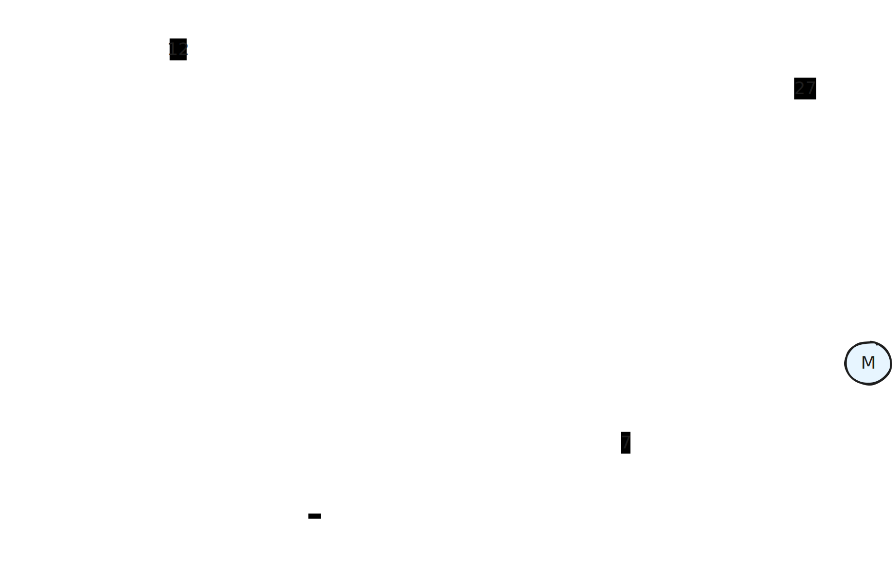
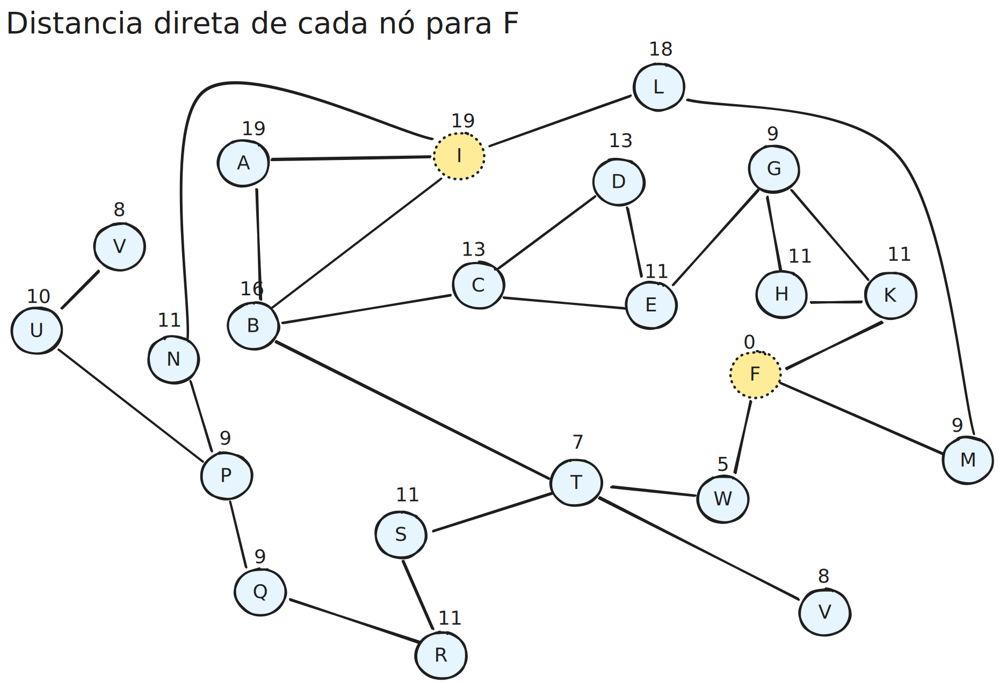

# unesp-ia-buscas

Exercícios de busca local para disciplina de inteligência artificial do programa de mestrado, o desafio era partir da cidade I e ir até F comparando os diferentes métodos: Hill Climbing, Best First, Custo Uniforme e A*
## Cenário


### App.java, na primeira abordagem tem a seguinte saída utilizando o método Hill Climbing
```
Finding a path from I to F
    The closest neighbour from I is A you can go there in 3 minutes.
    The closest neighbour from A is B you can go there in 3 minutes.
    The closest neighbour from B is C you can go there in 4 minutes.
    The closest neighbour from C is D you can go there in 3 minutes.
    The closest neighbour from D is E you can go there in 2 minutes.
    The closest neighbour from E is G you can go there in 3 minutes.
    The closest neighbour from G is H you can go there in 3 minutes.
    The closest neighbour from H is K you can go there in 2 minutes.
    The closest neighbour from K is F you can go there in 8 minutes.
We have arrived at F
```

## Em seguida foi testado a abordagem Best First (Guloso), nessa heurística a avaliação passou a ser realizada através da distância de cada nó para F. 


```
Finding a path from I to F by the best first search
    The closest neighbour from F from I is N you would be then 11 minutes away from F.
    The closest neighbour from F from N is P you would be then 9 minutes away from F.
    The closest neighbour from F from P is Q you would be then 9 minutes away from F.
    The closest neighbour from F from Q is R you would be then 11 minutes away from F.
    The closest neighbour from F from R is S you would be then 11 minutes away from F.
    The closest neighbour from F from S is T you would be then 7 minutes away from F.
    The closest neighbour from F from T is W you would be then 5 minutes away from F.
    The closest neighbour from F from W is F you would be then 0 minutes away from F.
We have arrived at F
```
Adaptei o código para que ele finalizasse com uma rota, mas a abordagem original pode não retornar até o final pois não é um algoritmo completo.


## O Algoritmo A* é um pouco mais complexo que os demais, mas também é completo e sempre nos retorna a melhor rota, é bem semelhante com o algoritmo de Dijkstra, porém aqui consideramos também a distancia entre o nó atual e o destino.


Saída recomendada pela minha implementação:   

```
The shortest path from I to F based on A* is:

I -> B -> T -> W -> F
```